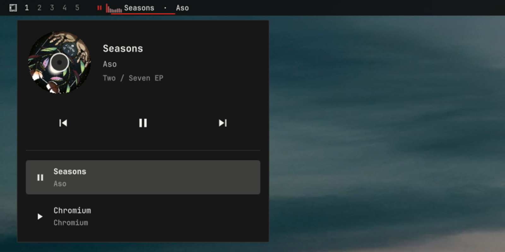
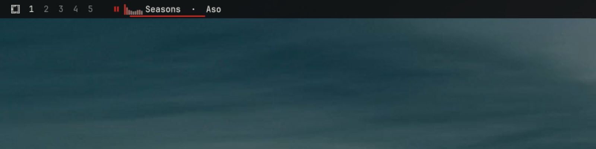
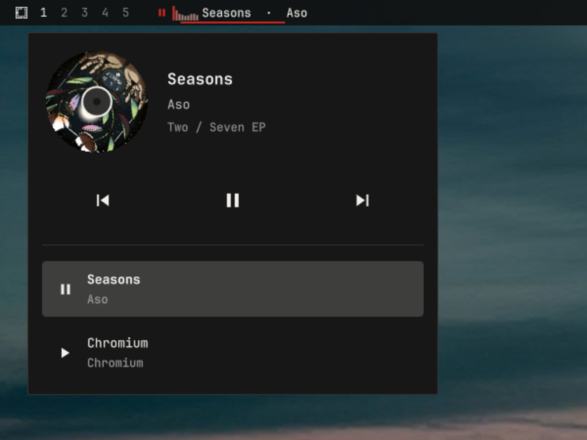

# Audio Visualizer

A now-playing media chip for the [Omarchy](https://omarchy.org) bar, with
playback controls, a live nine-band audio spectrum, a spacious track popup
with high-legibility metadata and a perfectly circular spinning album disk,
and multi-player source switching over MPRIS.

The chip is a **generic MPRIS client**: any MPRIS-capable player works —
mpv, Firefox, Chromium, Rhythmbox, Elisa, Audacious, and friends all show
up and can be controlled. There is no login, and no credentials or API
keys — if your desktop can show a media overlay for it, this chip can
display it.

The spectrum is computed by Cava from the default PipeWire output mix, so
it responds to **all audio on the default output**, independent of which
MPRIS source supplies metadata and controls.



## Features

- **Now-playing chip** in the bar: play/pause glyph, a live nine-band
  spectrum while playing, and a scrolling title · artist marquee.
- **Live FFT spectrum**: nine low-to-high frequency bands computed by
  Cava from the default PipeWire output — real signal data, not a
  looping animation (see [Spectrum](#spectrum)).
- **Quick controls from the bar** without opening anything (see
  [Controls](#controls)).
- **Spacious track popup**: the player's real album art fills a
  perfectly circular, record-style disk beside high-legibility title,
  artist, and album text sized to use the popup's width without
  clipping. A full-width transport deck carries three equal,
  generously sized previous / play-pause / next buttons, and the
  multi-player source rows span the popup with larger, clearer type.
  The disk spins only while the popup is open and the active player is
  playing; it sits still when playback is paused, the popup is closed,
  or no art is available.
- **Hardened album art**: remote cover art is fetched over HTTPS by a
  short-lived broker that re-encodes it to a small local PNG before
  display — QML never loads a remote image URL (see
  [Album artwork](#album-artwork)).
- **Multi-player source selection**: when several MPRIS players are
  running, the popup lists them all so you can pick which one the chip
  follows.
- **Standard media keys keep working**: the service keeps Omarchy's stock
  `media` IPC target, so your existing media-key bindings and scripts need
  no changes.

## Screenshots

### Live spectrum chip



### Spinning album disk and media controls



## Requirements

- [Omarchy](https://omarchy.org) 4.x with `omarchy-shell`.
- [Cava](https://github.com/karlstav/cava) (0.10.x) computes the
  spectrum from PipeWire's default output monitor. Install it with
  `omarchy pkg add cava`.
- [Pillow](https://python-pillow.github/) (Arch package
  `python-pillow`) decodes and re-encodes album artwork inside the
  broker, which runs under the system `/usr/bin/python3 -I -B`. Install
  it with `omarchy pkg add python-pillow`.
- Any MPRIS-capable player: the plugin only reads and controls what the
  player exposes over MPRIS.

## Install

From any Omarchy machine:

```bash
omarchy plugin add https://github.com/rmacy/omarchy-audio-visualizer.git --enable
```

The chip appears in the left bar section when media is playing
(`omarchy bar move` relocates it). Enabling this plugin disables the
built-in `omarchy.media` widget it replaces.

Manual alternative: clone or copy this folder to
~/.config/omarchy/plugins/bitr0t.spotify-menu-chip/, run
`omarchy-shell shell rescanPlugins`, then
`omarchy plugin enable bitr0t.spotify-menu-chip`.

## Controls

| Action                     | Result                                   |
|----------------------------|------------------------------------------|
| Left-click chip            | Play / pause the active player           |
| Middle-click chip          | Next track                               |
| Right-click chip           | Open / close the track popup             |
| Scroll up on chip          | Previous track                           |
| Scroll down on chip        | Next track                               |
| Popup buttons              | Previous / play-pause / next             |
| Popup source list          | Start/select that source, then pause the outgoing source after confirmation |
| Hover chip                 | Full "title — artist" tooltip            |

Play/Pause from the chip and popup uses **idempotent commands**. Chromium
and other normal players receive dedicated `Play` and `Pause`, even when a
cached state is stale; repeating either command cannot invert playback.
`spotify-player` is the verified exception for Play — it ignores dedicated
`Play`, so starting it uses a bounded Pause→PlayPause reset/retry sequence.
Its Play intent remains live through the handoff window, and the expected
stale `Paused` edge from the reset cannot overwrite an already-active stream.
Toggle-only fallbacks remain guarded. Source handoffs use the same player-safe
methods and pause outgoing only after synchronized target confirmation.

The chip icon and its next click are based on confirmed synchronized state,
never a pending intent. A Pause icon remains visible until the audio link
actually stops, so a second click sends another idempotent Pause instead of
accidentally sending Play. Pending intent remains internal to handoff
selection and duplicate-toggle suppression. Calls still go directly from
Quickshell to MPRIS; a Rust subprocess or daemon would add another IPC hop
without fixing player state.

MPRIS is not trusted indefinitely for runtime state. Once a player has a
matching PipeWire playback stream, `pulse.corked` is authoritative when
available, with active-link edges as the fallback. Raw link edges are tracked
separately from confirmed state so an MPRIS Pause remains stable even when
Chromium leaves its old link object allocated as Active. External starts and
stops cannot remain hidden behind stale `PlaybackStatus` or a prior chip action.

## Source selection

With multiple players running, right-click the chip and pick a source in
the popup. A row click is a one-click, confirmation-driven handoff: the
clicked source becomes selected immediately and receives one state-aware
Play action. The outgoing source stays audible until the clicked player's
confirmed synchronized state reports `Playing`; only then does it receive
Pause. A target that cannot start or disappears therefore never silences
the working source, and the selection rolls back after three seconds.

Rows are sorted by stable application identity, never by the current track
or play state, so a handoff cannot move another target under the pointer.
A meaningful track row stays in place through transient capability churn;
while Chromium advertises neither Play nor PlayPause it is dimmed, disabled,
and labelled unavailable. Stopped identity-only endpoints with no meaningful
track are omitted because no valid plugin action can start them.

An already-playing target transfers immediately without another Play
call. Clicking the selected paused source starts it. A newer row click
supersedes an in-flight handoff and cancels the prior target request.

Sources can also be cycled through IPC: `sourceNext` and
`sourcePrevious` select without transferring playback, while
`sourceSwitch` and `sourceSwitchPrevious` use the same confirmed handoff
(for example, `omarchy-shell media sourceSwitch`).

## Media keys

The service registers the same `media` IPC target as the built-in plugin,
so Omarchy's stock media-key bindings (`playPause`, `next`, `previous`,
`play`, `pause`, plus `status` and `ping`) continue to work unchanged
while this plugin is enabled.

## Spectrum

The chip draws a compact **frequency spectrum**: nine bars spanning low
to high frequencies (60 Hz to 12 kHz), computed by a real FFT of the
default PipeWire output mix. It reflects what the audio is actually
doing right now — it is not a looping decoration.

- **FFT via Cava**: the headless service runs one `cava` process driven
  by the bundled `cava.conf` — PipeWire's default output monitor, nine
  bands from 60 Hz to 12 kHz at 60 fps. Cava is a runtime dependency;
  the service looks for it at `/usr/bin/cava`.
- **One process, every bar**: the Cava process lives in the headless
  service, and every bar instance on every monitor reads the same
  published levels — bars never spawn their own analyzers.
- **Low-latency lifecycle**: hovering the chip or opening the popup
  prewarms Cava. Pause clears the bars immediately but keeps that one
  process warm for at most five seconds, covering quick resume and a
  confirmed source handoff without paying Cava's startup cost again.
  After the window it stops completely. Cava's own sleep polling is
  disabled only during this bounded lifetime, so active playback cannot
  wait up to a second for the analyzer to wake.
- **Responsive rendering**: new frames arrive every 16.7 ms, bar motion
  settles in 16 ms, and reduced Cava temporal smoothing follows transients
  substantially faster than the previous 25 fps / 45 ms pipeline.
  Unexpected exits restart after 2 seconds.

Because the FFT taps the default PipeWire output mix rather than one
player's private stream, the bands show whatever is audible — with
several players running, the spectrum reflects the whole mix, not the
selected player alone. Its on/off state still follows the selected
source: pausing that player — or selecting a source that is still
paused — stops the visualizer and clears the bars even while other
audio remains audible, and it resumes only once the selected source
is actually playing. Silence or pause settles every band at zero.

Each bar's height is its band's current energy, shaped by a gentle
`pow(level, 0.72)` curve so quiet material still reads visually.

## Album artwork

The popup's spinning disk shows album art, but the plugin never loads a
remote URL into QML and never renders the bytes a player advertises.
Every remote image is fetched and sanitized by a short-lived broker
(`artwork_broker.py`, system Python + Pillow) before the widget sees
it: QML only ever renders a broker-produced local PNG or the art-less
placeholder. The service passes the broker one request per URL as a
single stdin JSON line of at most 4096 bytes and reads back one bounded
JSON result. Exact policy and limits:

- **Scheme** — only absolute `https://` URLs are fetched: effective
  port 443, no userinfo, fragment, or zone ID, and at most 2048 UTF-8
  bytes. `file://`, `data:`, `http://`, non-public hosts, unsupported
  media, and failed fetches all fall back to the placeholder — they
  are never opened directly.
- **Destination** — every DNS answer of every hop must be a globally
  routable unicast address; private, loopback, link-local, CGNAT,
  multicast, unspecified, reserved, and documentation ranges,
  IPv4-mapped IPv6, and NAT64 (`64:ff9b::/96`) are rejected outright.
  The connection is made only to a vetted numeric IP, while the
  original hostname is kept for TLS SNI, certificate validation, and
  the `Host` header. Proxy environment variables are ignored. This
  broker fetch is the plugin's only outbound network traffic.
- **Redirects** — at most 3, each hop revalidated under the same rules;
  redirect loops, downgrades to `http://`, and non-443 targets are
  rejected.
- **Response** — HTTP 200 only, identity encoding only, and a declared
  `image/png` or `image/jpeg` that matches the actual payload. The body
  is streamed with a hard cap of **2 MiB encoded bytes**; the reader
  always attempts one byte past the cap so oversized responses are
  rejected, never silently truncated. The exchange runs under a 10 s
  total deadline (3 s per connect/read slice), and the QML helper waits
  at most 12 s.
- **Decode and re-encode** — Pillow decodes inside the short-lived
  broker process: animated or malformed files are rejected, as are
  images over **2048 px** on either side or **4,194,304 px** in total.
  The image is then verified and re-loaded, EXIF-transposed, converted
  to RGB/RGBA, thumbnailed to at most **512×512**, and re-encoded as a
  metadata-free canonical PNG — the only image data the plugin renders.
- **Local publication** — the canonical PNG is content-addressed and
  published atomically with `0600` permissions into a `0700`,
  symlink-resistant spool at
  `$XDG_RUNTIME_DIR/omarchy-audio-visualizer/artwork`, which lives on
  the session's tmpfs and disappears with the session.
- **Cache and races** — the spool is capped at **16 files / 16 MiB**.
  Results that arrive after the generation, player, or track has moved
  on are discarded, and art clears the moment the source changes. The
  service only ever publishes a verified `file://` URL — or nothing —
  and the bar widget's `Image.source` consumes that alone.
- **No self-installation** — the broker is spawned as
  `/usr/bin/python3 -I -B artwork_broker.py`; it never invokes a
  package manager, `pip`, a shell, or `curl`, and installs nothing.

## Uninstall

```bash
omarchy plugin remove bitr0t.spotify-menu-chip
```

Because the plugin declares `omarchy.clonedFrom: omarchy.media`, removing
(or disabling) it restores the built-in Omarchy media widget, keeping your
bar position and media-key bindings intact.

## Files

| File                      | Purpose                                                          |
|---------------------------|------------------------------------------------------------------|
| `manifest.json`           | Plugin identity, entrypoints, widget metadata, replacement rules |
| `Service.qml`             | Headless MPRIS service: players, actions, `media` IPC, Cava + artwork broker children |
| `BarWidget.qml`           | The bar chip, spectrum, marquee, tooltip, and track/source popup  |
| `MediaModel.js`           | Pure helpers shared by the service and widget                     |
| `AudioVisualizerModel.js` | Pure spectrum-frame parser and band math for the service          |
| `tests/*.test.js`         | Exhaustive media, source, handoff, action, and spectrum matrices  |
| `cava.conf`               | Bundled Cava config: PipeWire output monitor, 9 bands, 60 fps     |
| `artwork_broker.py`       | Short-lived HTTPS artwork broker: fetch, decode, re-encode, spool |
| `pyproject.toml` + `poetry.lock` | Poetry development metadata for the broker's Python tests |

## Development

Run the complete dependency-free JavaScript suite:

```bash
node --test tests/*.test.js
```

The registered scenario matrices cover:

- spectrum parsing, normalization, silence floors, summaries, malformed
  frames, delimiters, counts, ranges, and numeric boundaries;
- metadata, identity, proxy, capability, action, and PipeWire truth tables;
- source visibility, eligibility, stable ordering, and stream matching;
- MPRIS/PipeWire precedence, first-observation fallback, stream lifecycle
  sequences, external starts/stops, and contradictory optimistic intents;
- one-click handoff planning, confirmation, timeout, player removal,
  supersession, rollback, and optimistic in-flight states;
- exact Play/Pause/Next/Previous dispatch, toggle-first precedence,
  dedicated fallbacks, no-op guards, and stale-property rapid actions.

For focused work, the original compact suite remains directly runnable:

```bash
node tests/AudioVisualizerModel.test.js
```

The artwork broker has a focused Python security suite. Development
metadata is Poetry-based (`poetry install` once); at runtime the service
just runs system `/usr/bin/python3 -I -B` against Arch's
`python-pillow`, with no virtual environment:

```bash
poetry run python -m unittest tests/test_artwork_broker.py
```

Validate the complete plugin manifest and layout:

```bash
omarchy plugin validate .
```

Pure tests prove deterministic policy and math, not rendered pixels or an
external player's MPRIS compliance. QML changes still require a clean live
shell load, and media integration changes require a real or controlled
MPRIS handoff smoke test. Reload with
`omarchy-shell shell rescanPlugins`.

## License

[MIT](LICENSE). Derived from Omarchy's built-in media plugin; runtime code
Copyright (c) David Heinemeier Hansson and the Omarchy project, with 2026
modifications by Ryan Macy.
